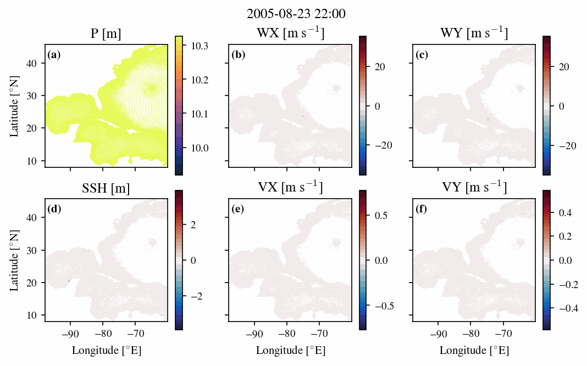
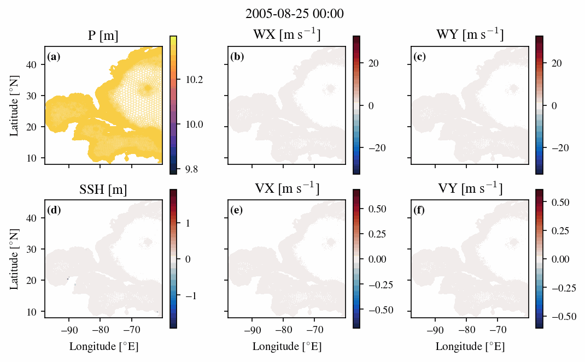

# SurgeNet: Graph Neural Network Surrogate Model for Storm Surge Prediction, descended from mSWE-GNN Repository

[](https://doi.org/10.5281/zenodo.17711455)


## Introduction

We created additional training data through forcing the ADCIRC model with storm surge scenarios from the ADFORCE python package using TC data from IBTraCS.

Look at the `adforce/generate_training_data.py` script for how we generated the training data:
<https://github.com/sdat2/PotentialHeight/blob/main/adforce/generate_training_data.py>

We have adapted the pytorch geometric based mSWE-GNN code to work with the ADFORCE data structure and to create models that can emulate storm surge events over the North West Atlantic/ Carribean Mesh. Here is an example of the ADCIRC input/output data animation for Hurricane Katrina (on the dual graph):



The training data has a 2 hourly output, but the numerical timestep for ADCIRC is 5 seconds. Tides, waves, and riverine inputs are excluded.

## Environment setup

Using `micromamba` and flexible yaml settings for a robust pure-cpu environment:

```bash
micromamba create -n mswegnn -f env.yml
```

If you want to run on JASMIN GPU nodes (orchid), use:

```bash
micromamba create -n mswegnn-gpu -f env_jas_gpu.yml
```

If you need to use a different GPU to the Jasmin A100s, you might need to adjust the cuda version in the `env_jas_gpu.yml` file.

If you are installing the python environment through a different method instead, to locally install the `mswegnn` package, run:

```bash
pip install -e .
```

## ADFORCE pipeline file structure

- `adforce_main.py`: Main script to run the Adforce/SWE-GNN training pipeline.
- `conf/`: Configuration files for hyperparameters and settings.
- `archer2.slurm`: SLURM job script for running on the Archer2 supercomputer.
- `mswegnn/`: All the main code turned into a python package for easier management.
    - `database/`: Data handling and preprocessing modules. (not used).
    - `hug/`: Scripts for downloading and uploading datasets to Hugging Face.
        - `download_train.py`: download the training data from Hugging Face.
        - `download_test.py`: download the extreme test data from Hugging Face.
        - `upload.py`: upload the training data to Hugging Face. (ignore)
    - `models/`: Model definitions and architectures.
        - `adforce_processors.py`: graph neural network processor layers.
        - `adforce_base.py`: base flood model class (not used).
        - `adforce_models.py`: full model architectures.
        - `adforce_helpers.py`: helper functions for models.
    - `training/`: Training routines and loss functions.
        - `adforce_train.py`: training loop and evaluation.
        - `adforce_loss.py`: loss functions.
    - `utils/`: Utility functions for various tasks.
        - `adforce_dataset.py`: dataset loading and batching.
        - `adforce_scaling.py`: data normalization and scaling.
        - `adforce_evaluate_models.py`: model evaluation metrics.
        - `adforce_delta_animate.py`: animate delta predictions, and inputs and outputs using dataloader.
        - `adforce_rollout.py`: perform multi-step rollouts for predictions.
        - `adforce_loop.py`: Some utility functions for loading models from saved results directories.
        - `adforce_animate.py`: animate adforce inputs and outputs using dataloader (for training and test data).
        - `adforce_predict_animate.py`: predict and animate from a saved model checkpoint (and config.yaml file).
        - `adforce_predict_timeseries.py`: predict timeseries from a saved model checkpoint (and config.yaml file).
        - `adforce_misc.py`: load model from checkpoint, etc.
- `jasmin.slurm`: SLURM job script for running on the JASMIN supercomputer.
- `jasmin_gpu.slurm`: SLURM job script for running on JASMIN GPU (orchid A100) nodes.
- `env_jas_gpu.yml`: Micromamba environment file for JASMIN GPU nodes.
- `env.yml`: Micromamba environment file for local CPU usage.
- `requirements.txt`: Old original Python package dependencies (does not correctly install on most machines).
- `setup.py`: Setup file for locally installing the `mswegnn` package.

## Training data

The training data is published on Hugging Face as:

```bibtex
@misc{Thomas2025SurgeNetTrain,
  author    = {Thomas, Simon D. A.},
  title     = {SurgeNet Training Dataset},
  year      = {2025},
  publisher = {Hugging Face},
  doi       = {10.57967/hf/6971},
  url       = {https://huggingface.co/datasets/sdat2/surgenet-train}
}
```

You can download the training data using the `huggingface_hub` package, which is included in the `env.yml` file. A script to download the data is provided in `mswegnn/hug/download.py`, although the local path to save the data may need to be adjusted. Once this is done, run the following command:

```bash
python -m mswegnn.hug.download_train
```

## Extreme test data

We created extreme test data from the simulations of the Potential Height of Tropical Cyclone Storm Surges from 2015 and 2100, for New Orleans, Miami and Galveston. The numerical settings in ADCIRC are all the same as the training data, as is the mesh. 



This test data is also published on HuggingFace as:

```bibtex
@misc{Thomas2025SurgeNetTest,
    author    = {Thomas, Simon D. A.},
    title        = {SurgeNet Test Dataset -- Potential Height Simulations -- Alpha Version},
    year         = 2025,
    url          = { https://huggingface.co/datasets/sdat2/surgenet-test-ph },
    doi          = { 10.57967/hf/7006 },
    publisher    = { Hugging Face }
}
```

To download the test data, use the script in `mswegnn/hug/download_test.py`, adjusting the local path as needed. Then run the following command:

```bash
python -m mswegnn.hug.download_test
```

## Run instructions

To run the training pipeline, you must first specify the directories for the different datasets in the configuration file located at `conf/config.yaml`, or add them at run time using `hydra`. You can then run the following command:

```bash

python -m adforce_main

python -m adforce_main model_params.model_type=MonolithicMLP

python -m adforce_main model_params.model_type=MLP

```

## Results

The following table summarizes the one step ahead SSH performance of various models on the training (158 files), validation (23 files), test (47 files), and extreme test (18 files) datasets, measured in Root Mean Square Error (RMSE) in centimeters.

### RMSE Results (Lower is better)

**$\Delta$ SSH RMSE [cm]**

| Model | Train | Validation | Test | Extreme PH |
| :--- | :---: | :---: | :---: | :---: |
| SWE-GNN-K21-P3-H128 | 1.64 | 1.68 | 1.79 | 5.62 |
| SWE-GNN-K21-P2-H128 | 1.62 | 1.66 | 1.74 | 5.81 |
| SWE-GNN-K21-P1-H128 | 1.65 | 1.68 | 1.77 | 6.44 |
| SWE-GNN-K21-P1-H128-ReLU | 1.61 | **1.64** | **1.73** | 18.01 |
| SWE-GNN-K18-P1-H128 | 1.70 | 1.71 | 1.85 | 6.74 |
| SWE-GNN-K15-P3-H128 | 1.67 | 1.69 | 1.86 | **5.52** |
| SWE-GNN-K15-P1-H128 | 1.63 | 1.69 | 1.81 | 6.72 |
| SWE-GNN-K12-P1-H128 | **1.55** | 1.76 | 1.83 | 7.04 |
| SWE-GNN-K9-P1-H128 | 1.65 | 1.84 | 1.99 | 7.21 |
| SWE-GNN-K6-P1-H128 | 1.67 | 1.86 | 2.00 | 7.29 |
| SWE-GNN-K3-P1-H128-ReLU | 1.99 | 2.01 | 2.16 | 7.63 |
| SWE-GNN-K3-P1-H128 | 1.96 | 2.03 | 2.20 | 7.25 |
| GCN-GNN-P1-H128 | 2.93 | 2.67 | 2.87 | 6.94 |
| GAT-GNN-P1-H128 | 2.94 | 2.68 | 2.88 | 6.96 |
| Pointwise-MLP-P1-H128 | 3.08 | 2.74 | 3.03 | 6.80 |
| WholeMesh-MLP-P1-H128 | 3.14 | 3.05 | 3.43 | 29.66 |

**$\Delta \mid U \mid$ RMSE [cm s $^{-1}$ ]**

| Model | Train | Validation | Test | Extreme PH |
| :--- | :---: | :---: | :---: | :---: |
| SWE-GNN-K21-P3-H128 | 0.76 | **0.88** | 0.87 | 3.94 |
| SWE-GNN-K21-P2-H128 | 0.75 | 0.88 | **0.85** | 3.96 |
| SWE-GNN-K21-P1-H128 | 0.81 | 0.93 | 0.93 | 4.35 |
| SWE-GNN-K21-P1-H128-ReLU | 0.78 | 0.94 | 0.91 | 55.73 |
| SWE-GNN-K18-P1-H128 | 0.80 | 0.93 | 0.93 | 4.50 |
| SWE-GNN-K15-P3-H128 | 0.78 | 0.90 | 0.89 | **3.92** |
| SWE-GNN-K15-P1-H128 | 0.79 | 0.93 | 0.93 | 4.68 |
| SWE-GNN-K12-P1-H128 | 0.76 | 0.96 | 0.93 | 4.95 |
| SWE-GNN-K9-P1-H128 | **0.72** | 0.96 | 0.94 | 5.05 |
| SWE-GNN-K6-P1-H128 | 0.82 | 0.98 | 0.97 | 5.17 |
| SWE-GNN-K3-P1-H128-ReLU | 0.96 | 1.02 | 1.01 | 4.94 |
| SWE-GNN-K3-P1-H128 | 0.90 | 1.02 | 1.02 | 5.30 |
| GCN-GNN-P1-H128 | 1.28 | 1.17 | 1.17 | 4.43 |
| GAT-GNN-P1-H128 | 1.26 | 1.15 | 1.16 | 4.52 |
| Pointwise-MLP-P1-H128 | 1.43 | 1.24 | 1.28 | 4.40 |
| WholeMesh-MLP-P1-H128 | 1.53 | 1.50 | 1.59 | 17.88 |

---

### NSE Results (Higher is better)

**$\Delta$ SSH NSE**

| Model | Train | Validation | Test | Extreme PH |
| :--- | :---: | :---: | :---: | :---: |
| SWE-GNN-K21-P3-H128 | 0.731 | 0.639 | 0.664 | 0.395 |
| SWE-GNN-K21-P2-H128 | 0.735 | 0.643 | **0.679** | 0.346 |
| SWE-GNN-K21-P1-H128 | 0.721 | 0.628 | 0.664 | 0.188 |
| SWE-GNN-K21-P1-H128-ReLU | 0.734 | **0.644** | **0.679** | -5.349 |
| SWE-GNN-K18-P1-H128 | 0.704 | 0.616 | 0.635 | 0.111 |
| SWE-GNN-K15-P3-H128 | 0.722 | 0.635 | 0.637 | **0.416** |
| SWE-GNN-K15-P1-H128 | 0.729 | 0.623 | 0.649 | 0.117 |
| SWE-GNN-K12-P1-H128 | **0.753** | 0.593 | 0.640 | 0.029 |
| SWE-GNN-K9-P1-H128 | 0.722 | 0.555 | 0.576 | -0.016 |
| SWE-GNN-K6-P1-H128 | 0.716 | 0.543 | 0.572 | -0.039 |
| SWE-GNN-K3-P1-H128-ReLU | 0.594 | 0.467 | 0.499 | -0.139 |
| SWE-GNN-K3-P1-H128 | 0.608 | 0.455 | 0.480 | -0.029 |
| GCN-GNN-P1-H128 | 0.118 | 0.064 | 0.117 | 0.057 |
| GAT-GNN-P1-H128 | 0.114 | 0.056 | 0.114 | 0.051 |
| Pointwise-MLP-P1-H128 | 0.027 | 0.011 | 0.019 | 0.095 |
| WholeMesh-MLP-P1-H128 | -0.010 | -0.226 | -0.262 | -16.211 |


**$\Delta \mid U \mid$ NSE**

| Model | Train | Validation | Test | Extreme PH |
| :--- | :---: | :---: | :---: | :---: |
| SWE-GNN-K21-P3-H128 | 0.760 | **0.545** | 0.599 | **0.281** |
| SWE-GNN-K21-P2-H128 | **0.761** | 0.536 | **0.607** | 0.270 |
| SWE-GNN-K21-P1-H128 | 0.719 | 0.482 | 0.531 | 0.111 |
| SWE-GNN-K21-P1-H128-ReLU | 0.739 | 0.474 | 0.550 | -144.710 |
| SWE-GNN-K18-P1-H128 | 0.725 | 0.480 | 0.525 | 0.052 |
| SWE-GNN-K15-P3-H128 | 0.746 | 0.528 | 0.580 | 0.291 |
| SWE-GNN-K15-P1-H128 | 0.735 | 0.477 | 0.532 | -0.025 |
| SWE-GNN-K12-P1-H128 | 0.755 | 0.448 | 0.525 | -0.149 |
| SWE-GNN-K9-P1-H128 | 0.775 | 0.447 | 0.518 | -0.198 |
| SWE-GNN-K6-P1-H128 | 0.713 | 0.418 | 0.489 | -0.254 |
| SWE-GNN-K3-P1-H128-ReLU | 0.608 | 0.380 | 0.438 | -0.144 |
| SWE-GNN-K3-P1-H128 | 0.652 | 0.374 | 0.430 | -0.318 |
| GCN-GNN-P1-H128 | 0.301 | 0.183 | 0.248 | 0.079 |
| GAT-GNN-P1-H128 | 0.322 | 0.205 | 0.262 | 0.043 |
| Pointwise-MLP-P1-H128 | 0.121 | 0.079 | 0.107 | 0.093 |
| WholeMesh-MLP-P1-H128 | -0.007 | -0.358 | -0.383 | -13.998 |

### Performance Analysis

* **Architecture Superiority:** The domain-specific **SWE-GNN** consistently outperforms standard baselines. For $\Delta$SSH prediction, the best SWE-GNN model ($K=21$) achieves a Test RMSE of **1.74 cm**, a **~39% reduction in error** compared to standard GCN (2.87 cm) and GAT (2.88 cm) architectures.
* **Impact of Context:** Larger kernel sizes ($K=21$) and multi-step temporal context ($P=2$ or $P=3$) generally provide the best generalization. `SWE-GNN-K21-P3` maintains positive NSE scores (**>0.28**) even on the challenging "Extreme PH" dataset, whereas baselines drop near zero.
* **Generalization vs. Overfitting:** While the ReLU-based variant (`SWE-GNN-K21-P1-H128-ReLU`) performs well on the standard test set (RMSE 1.73 cm), it fails catastrophically on out-of-distribution extreme events (Extreme PH RMSE **18.01 cm**; NSE **-5.35**), indicating significant instability compared to the robust standard SWE-GNN.

### Model Nomenclature

The model identifiers (e.g., `SWE-GNN-K21-P3-H128`) follow this naming convention:

* **Architecture**
    * **SWE-GNN:** Physics-informed Graph Neural Network based on Shallow Water Equations.
    * **GCN / GAT:** Standard Graph Convolutional Network and Graph Attention Network baselines.
    * **MLP:** Baseline Multi-Layer Perceptrons (Pointwise or Whole-Mesh).

* **Hyperparameters**
    * **$K$ (Kernel Size):** The number of spatial neighbors (stencil size) included in the message passing layer (e.g., $K=21$).
    * **$P$ (Temporal Context):** The number of historical timesteps used as input features (e.g., $P=3$ uses $t_{-1}, t_{-2}, t_{-3}$).
    * **$H$ (Hidden Dimension):** The size of the hidden layers in the MLPs (fixed at $H=128$).
* **Variants**
    * **ReLU:** Indicates the model uses the ReLU activation function after message passing layers (default is `tanh`).


# Old README content:
# mSWE-GNN (Repository for paper "Multi-scale hydraulic graph neural networks for flood modelling")
(Version 1.1 - Nov. 28th, 2024)


## Overview

For reproducing the paper's results, explore **plot_results.ipynb**

For training the model run **main.py**

For training and exploring the model, run **main.ipynb**

For testing a model, run **test_model.py**

Both **main.py** and **main.ipynb** use a **config.yaml** as reference configuration file.

The repository is divided in the following folders:

* **database:** Creation of hydrodynamic simulations (**D-Hydro simulations.ipynb**) [requires the license and installation of "D-HYDRO Suite 1D2D"] and conversion of the NETCDF output files into PyTorch Geometric-friendly data (**create_dataset.ipynb**).
Also contains the output of the hydrodynamic simulations (**raw_datasets**: for downloading the datasets go to <https://doi.org/10.5281/zenodo.13326595>). This is converted into Pickle files that are then stored and separated into training and testing datasets in **datasets**.

* **models:**  Deep learning models developed for surrogating the hydraulic one: contains a base class with common inputs and functions and one for the SWE-GNN and mSWE-GNN models.

* **results:** Contains results and trained models of the mSWE-GNN Pareto front, used for the paper's results.

* **training:** Contains loss and training functions.

* **utils:** Contains Python functions for loading, creating and scaling the dataset. There are also other miscellaneous functions and visualization functions.

## Environment setup

The required libraries are in `requirements.txt.`